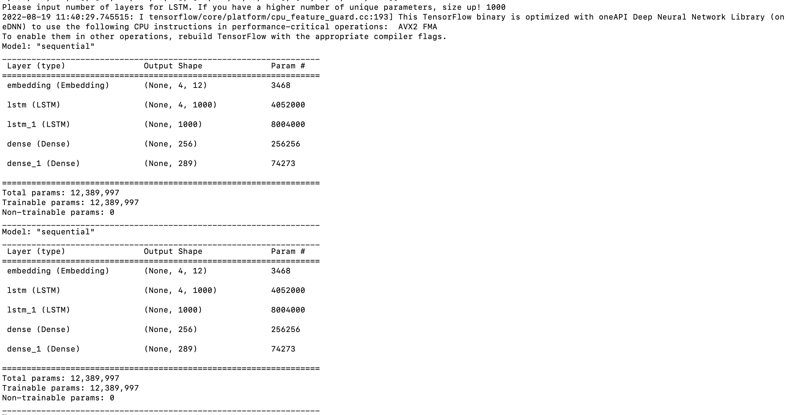
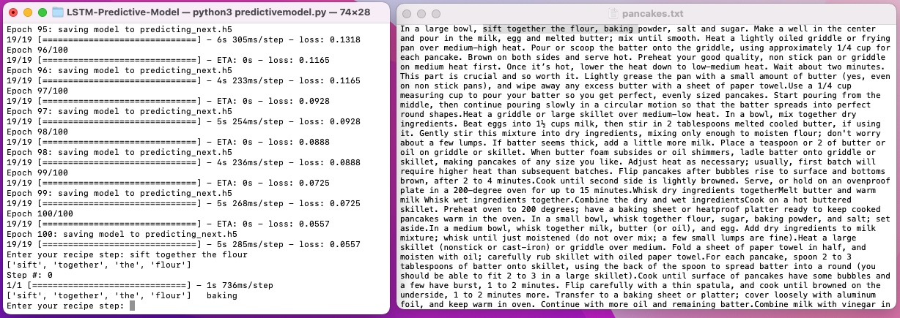
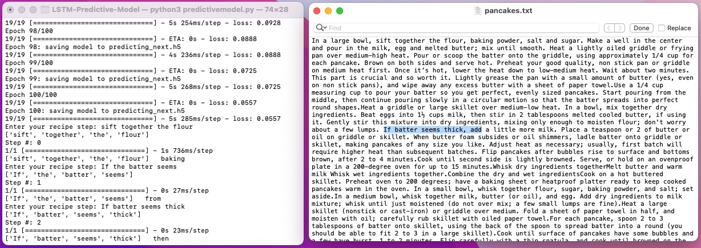

After our demo on Wednesday, we added more features to allow more of a personalized experience for the user. This is an analyzation of the result of the script: 
Here, the user chose for the predictive word to be printed after 4 words. 
You can see the words are transformed into sequences show in 5 parts: [ 1stword, 2ndword, 3rdword, 4thword, 5thword ] 

 

The selected numbers of layers for the LSTM layer was 1,000. 

The selected number of epochs were 100 and the batch size was set to 32. 

As you can see, the initial loss value (this loss value is equivalalent the mean squared error for regression and the log loss for classification) 
was quite high: 5.618. 

![Epoch Results:]results/EpochResults.jpeg)

After the 100 epochs of 32 batch size was run, it drastically decreased to 0.0557. 
We also obtained a few almost completely accurate results: 

And also less accurate ones depending on the overall words entered into the program: 

The results are also dependent on the sample file that the user puts in. If the dataset was smaller and contained less diverse vocabulary, then the prediction would be more accurate. Thank you for reading and we hope you enjoyed! 

